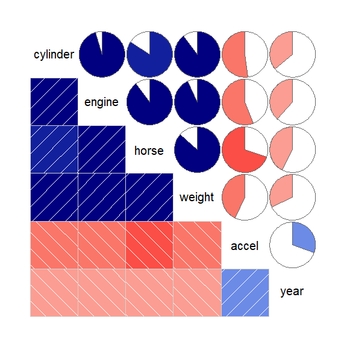
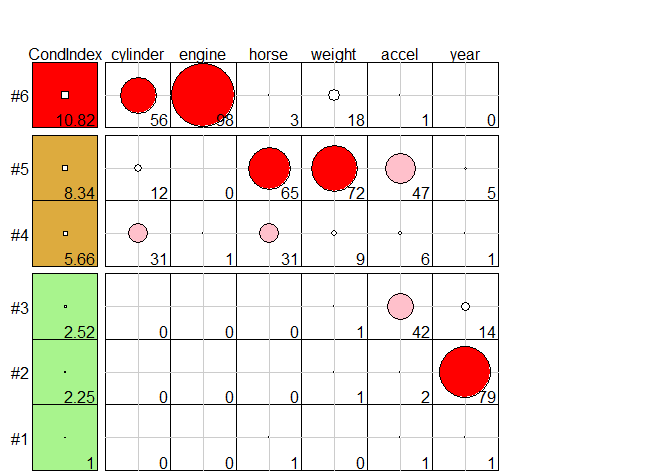
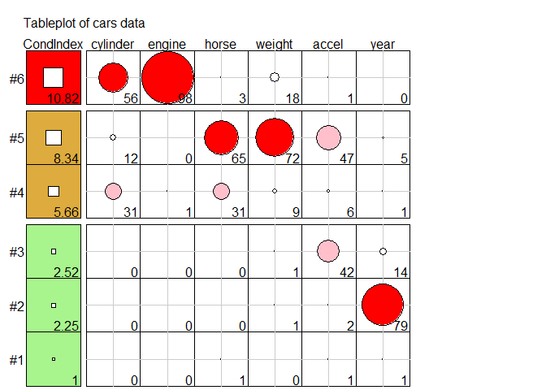
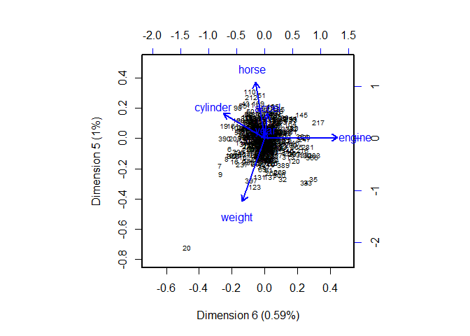

<!-- README.md is generated from README.Rmd. Please edit that file -->
<!-- badges: start -->

[](https://lifecycle.r-lib.org/articles/stages.html#stable)
[](https://www.gnu.org/licenses/gpl-2.0.html)
[](https://cran.r-project.org/package=VisCollin)
[](https://github.com/friendly/VisCollin)
[](https://www.r-pkg.org:443/pkg/VisCollin)
<!-- badges: end -->

# VisCollin 

**Visualizing Collinearity Diagnostics**

Version 0.1.2

The `VisCollin` package provides methods to calculate diagnostics for
multicollinearity among predictors in a linear or generalized linear
model. It also provides methods to visualize those diagnostics following
Friendly & Kwan (2009), “Where’s Waldo: Visualizing Collinearity
Diagnostics”, *The American Statistician*, **63**, 56–65.

These include:

- better **tabular presentation** of collinearity diagnostics that
  highlight the important numbers.
- a semi-graphic **tableplot** of the diagnostics to make warning and
  danger levels more salient and
- a **collinearity biplot** of the *smallest dimensions* of predictor
  space, where collinearity is most apparent.

## Installation

|                     |                                                 |
|---------------------|-------------------------------------------------|
| CRAN version        | `install.packages("VisCollin")`                 |
| Development version | `remotes::install_github("friendly/VisCollin")` |

## Tutorial example

``` r
library(VisCollin)
library(dplyr)
library(tidyr)
library(car)
library(corrplot)
```

This example uses the `cars` data set containing various measures of
size and performance on 406 models of automobiles from 1982. Interest is
focused on predicting gas mileage, `mpg`.

``` r
data(cars, package = "VisCollin")
str(cars)
#> 'data.frame':    406 obs. of  10 variables:
#>  $ make    : Factor w/ 30 levels "amc","audi","bmw",..: 6 4 22 1 12 12 6 22 23 1 ...
#>  $ model   : chr  "chevelle" "skylark" "satellite" "rebel" ...
#>  $ mpg     : num  18 15 18 16 17 15 14 14 14 15 ...
#>  $ cylinder: int  8 8 8 8 8 8 8 8 8 8 ...
#>  $ engine  : num  307 350 318 304 302 429 454 440 455 390 ...
#>  $ horse   : int  130 165 150 150 140 198 220 215 225 190 ...
#>  $ weight  : int  3504 3693 3436 3433 3449 4341 4354 4312 4425 3850 ...
#>  $ accel   : num  12 11.5 11 12 10.5 10 9 8.5 10 8.5 ...
#>  $ year    : int  70 70 70 70 70 70 70 70 70 70 ...
#>  $ origin  : Factor w/ 3 levels "Amer","Eur","Japan": 1 1 1 1 1 1 1 1 1 1 ...
```

### Fit a model

Fit a model predicting gas mileage (`mpg`) from the number of cylinders,
engine displacement, horsepower, weight, time to accelerate from 0 – 60
mph and model year (1970–1982). Perhaps surprisingly, only `weight` and
`year` appear to significantly predict gas mileage. What’s going on
here?

``` r
cars.mod <- lm (mpg ~ cylinder + engine + horse + weight + accel + year, 
                data=cars)
Anova(cars.mod)
#> Anova Table (Type II tests)
#> 
#> Response: mpg
#>           Sum Sq  Df F value Pr(>F)    
#> cylinder      12   1    0.99   0.32    
#> engine        13   1    1.09   0.30    
#> horse          0   1    0.00   0.98    
#> weight      1214   1  102.84 <2e-16 ***
#> accel          8   1    0.70   0.40    
#> year        2419   1  204.99 <2e-16 ***
#> Residuals   4543 385                   
#> ---
#> Signif. codes:  0 '***' 0.001 '**' 0.01 '*' 0.05 '.' 0.1 ' ' 1
```

`lmtest::coeftest()` shows the coefficients, $\hat{\beta_j}$, their
standard errors $s(\hat{\beta_j})$ and associated $t$ statistics,
$t = \hat{\beta_j} / s(\hat{\beta_j})$. As we will see, the standard
errors of the non-significant predictors have been inflated due to high
multiple correlations among the predictors, making the $t$ statistics
smaller.

``` r
lmtest::coeftest(cars.mod)
#> 
#> t test of coefficients:
#> 
#>              Estimate Std. Error t value Pr(>|t|)    
#> (Intercept) -1.45e+01   4.76e+00   -3.05   0.0024 ** 
#> cylinder    -3.30e-01   3.32e-01   -0.99   0.3212    
#> engine       7.68e-03   7.36e-03    1.04   0.2973    
#> horse       -3.91e-04   1.38e-02   -0.03   0.9775    
#> weight      -6.79e-03   6.70e-04  -10.14   <2e-16 ***
#> accel        8.53e-02   1.02e-01    0.84   0.4038    
#> year         7.53e-01   5.26e-02   14.32   <2e-16 ***
#> ---
#> Signif. codes:  0 '***' 0.001 '**' 0.01 '*' 0.05 '.' 0.1 ' ' 1
```

### Correlation matrix

It is often recommended to examine the correlation matrix of the
predictors to diagnose collinearity problems. In the general case, this
advice is misguided, because it is not the 0-order correlations that
matter, but rather the **multiple correlations** predicting each
independent variable from the others, $R_{x_j | \text{others}}$.

Nonetheless, it is instructive to examine the correlations.

``` r
R <- cars |> 
  select(cylinder:year) |> 
  tidyr::drop_na() |>
  cor()

100 * R |> round(digits = 2)
#>          cylinder engine horse weight accel year
#> cylinder      100     95    84     90   -52  -36
#> engine         95    100    90     93   -56  -38
#> horse          84     90   100     87   -70  -42
#> weight         90     93    87    100   -43  -32
#> accel         -52    -56   -70    -43   100   30
#> year          -36    -38   -42    -32    30  100
```

Or, better yet, use `corrplot::corrplot.mixed()` to visualize them,
using color and shading of glyphs,

``` r
corrplot.mixed(R, lower = "square", upper = "ellipse", tl.col = "black")
```



The message here seems to be that there are two clusters of predictors
with high correlations: {`cylinder`, `engine`, `horse` and `weight`},
and {`accel`, `year`}.

### Variance inflation factors

Variance inflation factors measure the effect of multicollinearity on
the standard errors of the estimated coefficients and are proportional
to $1 / (1 - R^2_{x_j | \text{others}})$.

We check the variance inflation factors, using `car::vif()`. We see that
most predictors have very high VIFs, indicating moderately severe
multicollinearity.

``` r
vif(cars.mod)
#> cylinder   engine    horse   weight    accel     year 
#>    10.63    19.64     9.40    10.73     2.63     1.24

sqrt(vif(cars.mod))
#> cylinder   engine    horse   weight    accel     year 
#>     3.26     4.43     3.07     3.28     1.62     1.12
```

According to $\sqrt{\text{VIF}}$, the standard error of `cylinder` has
been multiplied by 3.26 and it’s $t$-value divided by this number,
compared with the case when all predictors are uncorrelated. `engine`,
`horse` and `weight` suffer a similar fate.

### Collinearity diagnostics

The diagnostic measures introduced by Belsley (1991) are based on the
eigenvalues $\lambda_1, \lambda_2, \dots \lambda_p$ of the correlation
matrix $R_{X}$ of the predictors (preferably centered and scaled, and
not including the constant term for the intercept), and the
corresponding eigenvectors in the columns of $\mathbf{V}_{p \times p}$.

`colldiag()` calculates:

- **Condition indices**: The smallest of the eigenvalues, those for
  which $\lambda_j \approx 0$, indicate collinearity and the number of
  small values indicates the number of near collinear relations. Because
  the sum of the eigenvalues, $\Sigma \lambda_i = p$ increases with the
  number of predictors $p$, it is useful to scale them all in relation
  to the largest. This leads to *condition indices*, defined as
  $\kappa_j = \sqrt{ \lambda_1 / \lambda_j}$. These have the property
  that the resulting numbers have common interpretations regardless of
  the number of predictors.

  - For completely uncorrelated predictors, all $\kappa_j = 1$.

  - $\kappa_j \rightarrow \infty$ as any $\lambda_k \rightarrow 0$.

  - In terms of the eigen-decomposition, variance inflation factors can
    be expressed as $$
    \text{VIF}_j = \sum_{k=1}^{p} \frac{V^2_{jk}}{\lambda_k} \; .
    $$

- **Variance decomposition proportions**: Large VIFs indicate variables
  that are involved in *some* nearly collinear relations, but they don’t
  indicate *which* other variable(s) each is involved with. For this
  purpose, Belsley et. al. (1980) and Belsley (1991) proposed
  calculation of the proportions of variance of each variable associated
  with each principal component as a decomposition of the coefficient
  variance for each dimension.

For the current model, the usual display contains both the condition
indices and variance proportions. However, even for a small example, it
is often difficult to know what numbers to pay attention to.

``` r
(cd <- colldiag(cars.mod, center=TRUE))
#> Condition
#> Index    Variance Decomposition Proportions
#>           cylinder engine horse weight accel year 
#> 1   1.000 0.005    0.003  0.005 0.004  0.009 0.010
#> 2   2.252 0.004    0.002  0.000 0.007  0.022 0.787
#> 3   2.515 0.004    0.001  0.002 0.010  0.423 0.142
#> 4   5.660 0.309    0.014  0.306 0.087  0.063 0.005
#> 5   8.342 0.115    0.000  0.654 0.715  0.469 0.052
#> 6  10.818 0.563    0.981  0.032 0.176  0.013 0.004
```

Belsley (1991) recommends that the sources of collinearity be diagnosed
(a) only for those components with large $\kappa_j$, and (b) for those
components for which the variance proportion is large (say, $\ge 0.5$)
on *two* or more predictors. The print method for `"colldiag"` objects
has a `fuzz` argument controlling this.

``` r
print(cd, fuzz = 0.5)
#> Condition
#> Index    Variance Decomposition Proportions
#>           cylinder engine horse weight accel year 
#> 1   1.000  .        .      .     .      .     .   
#> 2   2.252  .        .      .     .      .    0.787
#> 3   2.515  .        .      .     .      .     .   
#> 4   5.660  .        .      .     .      .     .   
#> 5   8.342  .        .     0.654 0.715   .     .   
#> 6  10.818 0.563    0.981   .     .      .     .
```

The mystery is solved: There are two nearly collinear relations among
the predictors, corresponding to the two smallest dimensions.

- Dimension 5 reflects the high correlation between horsepower and
  weight,
- Dimension 6 reflects the high correlation between number of cylinders
  and engine displacement.

Note that the high variance proportion for `year` (0.787) on the second
component creates no problem and should be ignored because (a) the
condition index is low and (b) it shares nothing with other predictors.

### Tableplot

The simplified tabular display above can be improved to make the
patterns of collinearity more visually apparent and to signify warnings
directly to the eyes. A “tableplot” (Kwan et-al., 2009) is a
semi-graphic display that presents numerical information in a table
using shapes proportional to the value in a cell and other visual
attributes (shape type, color fill, and so forth) to encode other
information.

For collinearity diagnostics, these show:

- the condition indices, using using *squares* whose background color is
  red for condition indices \> 10, green for values \> 5 and green
  otherwise, reflecting danger, warning and OK respectively. The value
  of the condition index is encoded within this using a white square
  whose side is proportional to the value (up to some maximum value,
  `cond.max`).
- Variance decomposition proportions are shown by filled *circles* whose
  radius is proportional to those values and are filled (by default)
  with shades ranging from white through pink to red. Rounded values of
  those diagnostics are printed in the cells.

The tableplot below encodes all the information from the values of
`colldiag()` printed above (but using `prop.col` color breaks such that
variance proportions \< 0.3 are shaded white). The visual message is
that one should attend to collinearities with large condition indices
**and** large variance proportions implicating two or more predictors.

<!-- ```{r cars-tableplot0} -->
<!--  -->
<!-- ``` -->

``` r
tableplot(cd, title = "Tableplot of cars data", cond.max = 30 )
```



### Collinearity biplot

The standard biplot (Gabriel, 1971; Gower& Hand 1996) can be regarded as
a multivariate analog of a scatterplot, obtained by projecting a
multivariate sample into a low-dimensional space (typically of 2 or 3
dimensions) accounting for the greatest variance in the data. With the
symmetric (PCA) scaling used here, this is equivalent to a plot of
principal component scores of the mean-centered matrix
$\widetilde{\mathbf{X}} = \mathbf{X} - \bar{\mathbf{X}}$ of predictors
for the observations (shown as points or case labels), together with
principal component coefficients for the variables (shown as vectors) in
the same 2D (or 3D) space.

However the standard biplot is less useful for visualizing the relations
among the predictors that lead to nearly collinear relations. Instead,
biplots of the **smallest dimensions** show these relations directly,
and can show other features of the data as well, such as outliers and
leverage points. We use `prcomp(X, scale.=TRUE)` to obtain the PCA of
the correlation matrix of the predictors:

``` r
cars.X <- cars |>
  select(where(is.numeric)) |>
  select(-mpg) |>
  tidyr::drop_na()
cars.pca <- prcomp(cars.X, scale. = TRUE)
cars.pca
#> Standard deviations (1, .., p=6):
#> [1] 2.070 0.911 0.809 0.367 0.245 0.189
#> 
#> Rotation (n x k) = (6 x 6):
#>             PC1    PC2    PC3    PC4     PC5     PC6
#> cylinder -0.454 0.1869 -0.168  0.659 -0.2711  0.4725
#> engine   -0.467 0.1628 -0.134  0.193 -0.0109 -0.8364
#> horse    -0.462 0.0177  0.123 -0.620 -0.6123  0.1067
#> weight   -0.444 0.2598 -0.278 -0.350  0.6860  0.2539
#> accel     0.330 0.2098 -0.865 -0.143 -0.2774 -0.0337
#> year      0.237 0.9092  0.335 -0.025 -0.0624 -0.0142
```

The standard deviations above are the square roots $\sqrt{\lambda_j}$ of
the eigenvalues of the correlation matrix, and are returned in the
`sdev` component of the `"prcomp"` object. The eigenvectors are returned
in the `rotation` component, whose directions are arbitrary.

``` r
# Make labels for dimensions include % of variance
pct <- 100 *(cars.pca$sdev^2) / sum(cars.pca$sdev^2)
lab <- glue::glue("Dimension {1:6} ({round(pct, 2)}%)")

# Direction of eigenvectors is arbitrary. Reflect them
cars.pca$rotation <- -cars.pca$rotation
```

The collinearity biplot is then constructed as follows:

``` r
op <- par(lwd = 2, xpd = NA )
biplot(cars.pca,
       choices=6:5,           # only the last two dimensions
       scale=0.5,             # symmetric biplot scaling
       cex=c(0.6, 1),         # character sizes for points and vectors
       col = c("black", "blue"),
       expand = 1.7,          # expand variable vectors for visibility
       xlab = lab[6],
       ylab = lab[5],
       xlim = c(-0.7, 0.5),
       ylim = c(-0.8, 0.5)
      )
par(op)
```



The projections of the variable vectors on the Dimension 5 and Dimension
6 axes are proportional to their variance proportions shown above. The
relative lengths of these variable vectors can be considered to indicate
the extent to which each variable contributes to collinearity for these
two near-singular dimensions.

Thus, we see again that Dimension 6 is largely determined by `engine`
size, with a substantial (negative) relation to `cylinder`. Dimension 5
has its’ strongest relations to `weight` and `horse`.

Moreover, there is one observation, \#20, that stands out as an outlier
in predictor space, far from the centroid. It turns out that this
vehicle, a Buick Estate wagon, is an early-year (1970) American
behemoth, with an 8-cylinder, 455 cu. in, 225 horse-power engine, and
able to go from 0 to 60 mph in 10 sec. (Its MPG is only slightly
under-predicted from the regression model, however.)

### Remedies for collinearity: What to do?

Collinearity is often a **data** problem, for which there is no magic
cure. Nevertheless there are some general guidelines and useful
techniques to address this problem.

- **Pure prediction**: If we are only interested in predicting /
  explaining an outcome, and not the model coefficients or which are
  “significant”, collinearity can be largely ignored. The fitted values
  are unaffected by collinearity.

- **structural collinearity**: Sometimes collinearity results from
  structural relations among the variables:

  - For example, polynomial terms, like $x, x^2, x^3$ or interaction
    terms like $x_1, x_2, x_1 * x_2$ are necessarily correlated. A
    simple cure is to *center* the predictors at their means, using
    $x - \bar{x}, (x - \bar{x})^2, (x - \bar{x})^3$ or
    $(x_1 - \bar{x}_1), (x_2 - \bar{x}_2), (x_1 - \bar{x}_1) * (x_2 - \bar{x}_2)$

  - When some predictors share a common cause, as in GNP or population
    in time-series or cross-national data, you can reduce collinearity
    by re-defining predictors to reflect *per capita measures*.

- **Model re-specification**:

  - Drop one or more regressors that have a high VIF if they are not
    deemed to be essential

  - Replace highly correlated regressors with linear combination(s) of
    them. For example, two related variables, $x_1$ and $x_2$ can be
    replaced without any loss of information by replacing them with
    their sum and difference, $z_1 = x_1 + x_2$ and $z_2 = x_1 - x_2$.

- **Statistical remedies**:

  - Transform the predictors to uncorrelated principal components

  - use **regularization methods** such as ridge regression and lasso,
    which correct for collinearity by introducing shrinking coefficients
    towards 0, introducing a small amount of bias, . See the
    [genridge](https://CRAN.R-project.org/package=genridge) package and
    its [`pkgdown` documentation](https://friendly.github.io/genridge/)
    for visualization methods.

  - use Bayesian regression; if multicollinearity prevents a regression
    coefficient from being estimated precisely, then a prior on that
    coefficient will help to reduce its posterior variance.

## References

Belsley, D.A., Kuh, E. and Welsch, R. (1980). *Regression Diagnostics*,
New York: John Wiley & Sons.

Belsley, D.A. (1991). *Conditioning diagnostics, collinearity and weak
data in regression*. New York: John Wiley & Sons.

Friendly, M., & Kwan, E. (2009). “Where’s Waldo: Visualizing
Collinearity Diagnostics.” *The American Statistician*, **63**, 56–65.
Online: <https://www.datavis.ca/papers/viscollin-tast.pdf>. Supp.
materials: <https://www.datavis.ca/papers/viscollin/>

Gabriel, K. R. (1971). The Biplot Graphic Display of Matrices with
Application to Principal Components Analysis. *Biometrics*, **58**,
453–467.

Gower, J. C., & Hand, D. J. (1996). *Biplots*. London: Chapman & Hall.

Kwan, E., Lu, I. R. R., & Friendly, M. (2009). Tableplot: A new tool for
assessing precise predictions. *Zeitschrift Für Psychologie / Journal of
Psychology*, **217**, 38–48.
